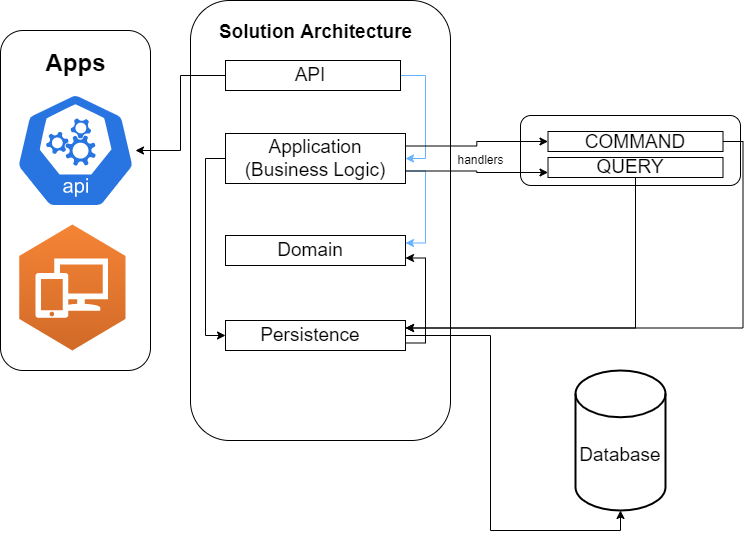

"# lagetronix-job-library-test-cqrs" 

To run the project run 

`dotnet watch run -p Api`

**OR**

open the `run.bat` file on a windows computer and `run.sh` on a Linux or Mac computer

**ONLY IF YOU HAVE DOTNET FRAMEWORK TOOLS**

<u>**ON Visual Studio**</u>

1. Open `Library.sln` 

2. Set API as the startup project **if** it is not the startup project.

3. Press `control key + F5` and the swagger documentation will open up in your browser.

### Project Architecture

This project uses the CQRS (Command Query Responsibility Segregation) + Mediator pattern, the CQRS pattern is an architectural pattern that separates reading and writing into two different models. It does responsibility segregation for the Command model & Query model.

Commands are literally **Create, Update, and Delete Statements**, While Queries are reads to the database.

Although this is an overkill for such a tiny application, but in terms of scalability, the CQRS pattern is very useful for:

1. Independent Scaling
2. Single Responsibility Principle
3. Separation of Concern
4. Easy implementation whern using multiple database for read and write operations.

So why did I use this pattern?

> Has this is just a code test, it's important to bring forth the most applicable knowledge about software engineering and scaling to stand out from everyone.

#### Project Description

* API Project:
    - Description: This is the project that serves as middleware/handshake between the backend and other applications.
    - Depends on: Application

* Application Project:
    - Description: This is the project that contains the business logic of a solution or application.
    - Depends on: Domain, Persistence

* Persistence Project:
    - Description: This is the project that communicates with the database regularly and keeps the database(s) in different stages or environment in sync.
    - Depends on: Domain

* Domain Project:
    - Description: This is the project that class mapppings to diffrent sql tables and request payloads.
    - Depends on: NULL